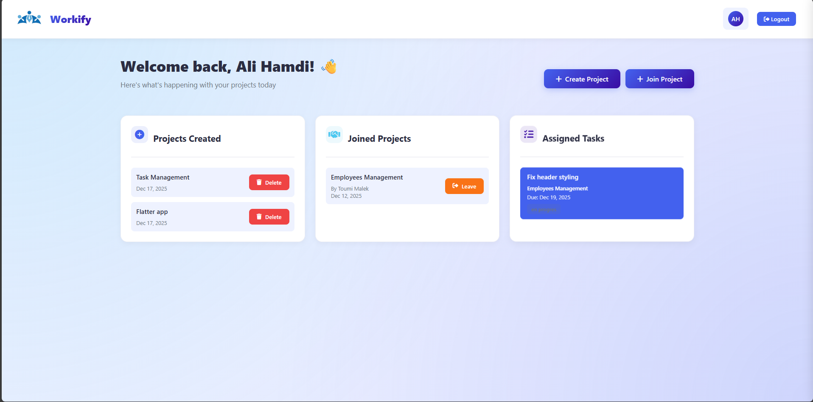
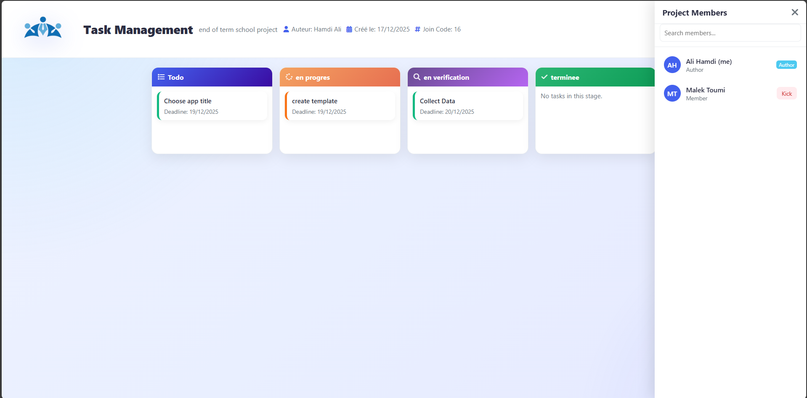
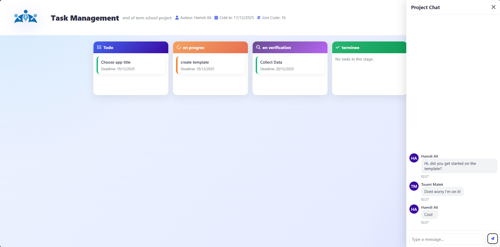

# Workify - Project Management Frontend

A modern, intuitive web application for managing projects, tasks, and team collaboration. This frontend is built to interface with our custom Project Management API [API Repository](https://github.com/malek-chermiti/project_management)

**🌐 Live Demo**: [https://workify.up.railway.app](https://workify.up.railway.app)


## 📋 Description

Workify is a comprehensive project management solution that allows teams to create projects, assign tasks, track progress, and collaborate in real-time through integrated chat functionality. Built with vanilla JavaScript and a clean, responsive design, it provides an excellent user experience across all devices.

## ✨ Features

- **User Authentication**: Secure login and signup system with JWT token-based authentication
- **Project Management**: 
  - Create and manage multiple projects
  - Join existing projects with project codes
  - View created and joined projects separately
  - Delete or leave projects
- **Task Management**:
  - Create, edit, and delete tasks
  - Drag-and-drop tasks between different states (Todo, In Progress, In Verification, Done)
  - Priority-based task ordering (High, Medium, Low)
  - Set deadlines and descriptions
  - Assign multiple team members to tasks
- **Team Collaboration**:
  - Add and manage project members
  - Real-time chat for each project
  - View assigned tasks across all projects
  - Author-based permissions (kick members, delete projects)
- **User Profile**:
  - View and edit personal information
  - Change password
  - Profile sidebar with detailed information
- **Responsive Design**: Works seamlessly on desktop, tablet, and mobile devices

## 🛠️ Technologies Used

- **HTML5**: Semantic markup and structure
- **CSS3**: Modern styling with CSS Grid, Flexbox, animations, and gradients
- **JavaScript (ES6+)**: Vanilla JavaScript for all functionality
- **Font Awesome**: Icon library for UI elements
- **Fetch API**: For all HTTP requests to the backend

## 🚀 Getting Started

### Prerequisites

- A modern web browser (Chrome, Firefox, Safari, Edge)
- Backend API running (see [API Repository](https://github.com/malek-chermiti/project_management))

### Live Application

The application is deployed and ready to use at: **[https://workify.up.railway.app](https://workify.up.railway.app)**

### Local Installation

1. Clone this repository:
```bash
git clone <repository-url>
cd Project-Management-
```

2. Update the `BASE_URL` in `fetch.js` to point to your backend:
```javascript
const BASE_URL = 'https://projectmanagement-production-d023.up.railway.app';
// or for local development:
// const BASE_URL = 'http://localhost:9090';
```

3. Open `index.html` in your web browser or serve it using a local server:
```bash
# Using Python
python -m http.server 8000

# Using Node.js
npx serve

# Using PHP
php -S localhost:8000
```

4. Navigate to `http://localhost:8000` (or appropriate port)

## 📡 API Integration

This frontend connects to our Project Management API deployed at `https://projectmanagement-production-d023.up.railway.app`.

**API Repository**: [https://github.com/malek-chermiti/project_management](https://github.com/malek-chermiti/project_management)

The base API URL can be easily configured in `fetch.js` by updating the `BASE_URL` constant at the top of the file.

All API calls are handled through `fetch.js`, which provides wrapper functions for:
- User authentication and profile management
- Project CRUD operations
- Task management
- Team member operations
- Real-time messaging

## 📄 Pages

- **index.html**: Landing page with feature showcase
- **form.html**: Login and signup forms
- **home.html**: User dashboard showing created projects, joined projects, and assigned tasks
- **projet.html**: Detailed project view with task board, members, and chat

## 🎨 Key Features Showcase

### Kanban Board
Drag-and-drop interface for managing tasks across four states with visual feedback and smooth animations.

### Real-time Chat
Integrated chat system that polls for new messages every 5 seconds, keeping teams connected.

### Task Assignment
Intuitive interface for assigning multiple team members to tasks with visual member badges.

### Responsive Design
Beautiful gradient backgrounds, smooth animations, and a mobile-friendly layout that adapts to any screen size.

## 🔐 Authentication

The application uses JWT (JSON Web Token) based authentication:
- Tokens are stored in `localStorage` after successful login
- All authenticated requests include the token in the `Authorization` header
- Sessions persist across browser refreshes

## 👥 Auteurs

- **Malek Toumi** — [https://github.com/MalekToumi-815](https://github.com/MalekToumi-815)
- **Malek Chermiti** — [https://github.com/malek-chermiti](https://github.com/malek-chermiti)

## 📸 Screenshots

### Home Dashboard
Overview of all projects and assigned tasks



### Project Management
Kanban board with drag-and-drop functionality



### Team Chat
Real-time collaboration interface



## 🤝 Contributing

This project was developed as a collaborative effort to create a full-stack project management solution. Feel free to fork and adapt it for your own use.

## 📝 License

This project is available for educational and personal use.

---

Built with ❤️ by Malek Toumi & Malek Chermiti
